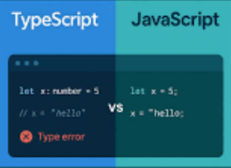

Initial Overview

  In my newbie experience with Typescript, I have found Typescript to be fairly easier to work with. I have worked with JavaScript before which Typescript is built on, making it very familiar to me. The logic is simple to implement as I have a few years experience with JavaScript already. It is also similar to Java which is another language I've used. For example, Java and TypeScript both require you to define what type of data a variable holds, and they are also Object-Oriented, requiring different classes to house code. I'm happy to be working with a new language that has familiar elements but provides a different user experience.

  Newly working with TypeScript, I have learned a few new things. For one, I have learned that I need more practice with it. I mentioned that I have worked with JavaScript however it has been some time, so I had to refresh myself on how to organize the logic of what I was trying to accomplish. I have also learned a few nuanced syntax related things. I'm used to using var but I learned in my ES6 module of my 314 Software Engineering course to use let or const for example. I found Typescript to be very user friendly in that there is a built in spellchecker for your logic, the autocomplete feature is convenient, and Typescript can take you directly to where a section of the code was originally created if you do not understand it. It will also be easier to collaborate with people using Typescript since it requires labelling unlike JavaScript.

Athletic Style Coding Approach

  The athletic software engineering consisting of new "workouts" in each teaching session is an interesting approach which I am not used to yet.  It kind of reminds me of It's Always Sunny when Frank throws the kid in the pool to teach him how to swim. Being newly introduced to it, it is admittedly uncomfortable but I think this rigid structure will cause people to put more energy into preparation for the WODs (workouts of the day) and help develop habits that lead to success. The practice workouts or WODS in this regiment are definitely useful to give a premonition to the following "real" workout of the day. At this point I understand that this method of learning is for our best interests to reach our full potential as programmers.

Having gone through this course environment before, I have a deeper appreciation for why this structure is in place. It is definitely intense and can be uncomfortable while the clock is ticking, but that rigid structure forces you to put genuine energy into preparation beforehand rather than trying to wing it.

The practice WODs are crucial because they give you a clear preview of the real workout of the day. Doing the practice runs builds the muscle memory needed so that when the real timer starts, you aren’t freezing up. At this point, I understand that this rigorous method is designed in our best interest to push us toward reaching our full potential as software engineers.

In The End

Returning to ICS 314 with TypeScript at the center has reinforced that good programming is about both reliable tools and practice. TypeScript provides the safety net and structure needed to write robust code, while the athletic coding regimen builds the discipline and speed to deliver under pressure.
