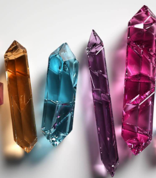

Crystal collector is a game that I created using HTML, CSS, and JS. In the game, each of the four crystals is worth a certain amount
of points and the object of the game is to use the value of the crystal to match a random generated number displayed on the screen.
There is an instructional menu above the game, a counter to keep track of wins and losses, and containers displaying the target score and current score.

In this project, I created everything. I did the styling, the front end items in HTML and the backend in JavaScript. I also chose the background image to create more of a mystical kind of vibe relative to the theme. If I dedicated more time to the project I could have made it more visually fluid.

Working on this game I was introduced to different math functions that I used in the JavaScript. I had to ensure that it was possible to reach the target score using the different crystal values. I also improved my skills with using counters to keep track of something like a score. On click functions to make the buttons work was another skill that I had to refresh. In the end, this game wasn't exceedingly difficult however I had to implement concepts that I had just recently learned at the time which required a little digging.

Below, I have a link to the actual game and below that a link to the repository containing all of the code.

<a href="https://github.com/bemmons1993/crystalcollector">Crystal Collector Game</a>

Source: <a href="https://github.com/bemmons1993/crystalcollector">Crystal Collector</a>
