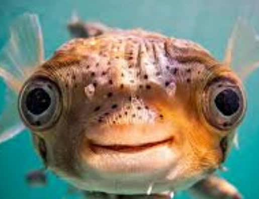

Fishing game is a project that I created in java. It allows users to catch fish choose to catch or release.
Different point amounts attributed to different kinds of fish caught.
 
Source: <a href="https://github.com/ICSatKCC/assignment-6-fishing-game-spring-25-los-pescadores">fishinggame</a>
