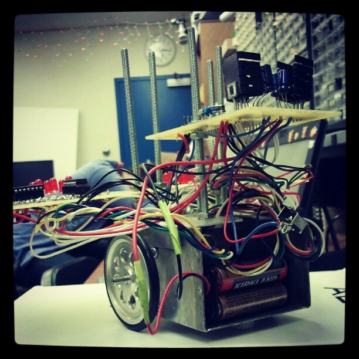

<div class="text-center p-4">
  
  
  
</div>

Pets Fur Friends is a project designated to find existing animals currently at shelters and pairing them with owners
who are in need of a furry friend. This project will allow the user to search for a pet using parameters such as proximity,
type of pet, color, etc.

    {   // wait until ADC conversion is completed   
    }
    return ADC1RL;  // lower 8-bit value out of 10-bit data from the ADC
}
```

You can learn more at the [UH Micromouse News Announcement](https://manoa.hawaii.edu/news/article.php?aId=2857).
